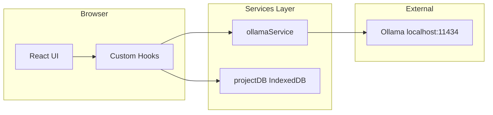
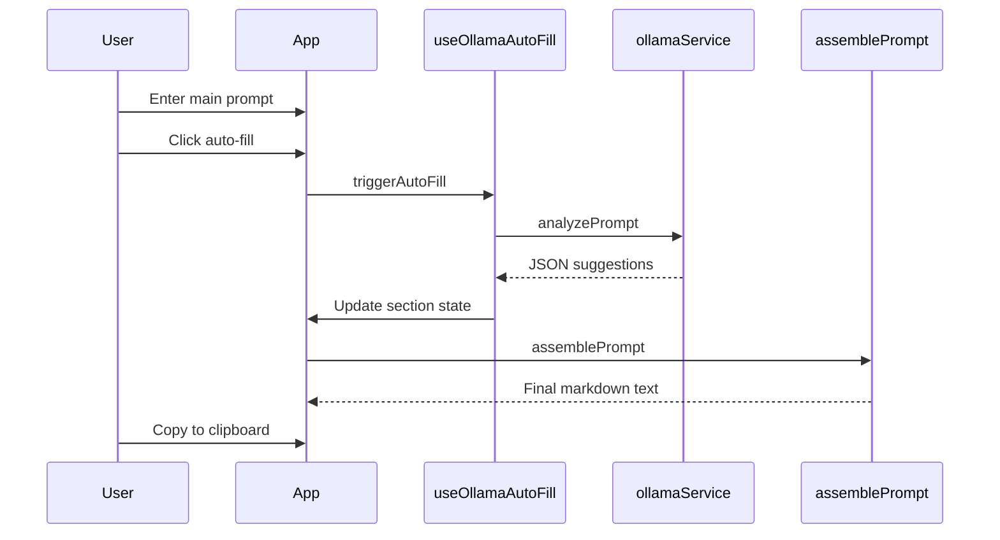

# Architecture

Prompt Checklist Builder is a client-side React application that structures LLM prompts through configurable sections, auto-fills fields via local Ollama, and assembles a final copy-ready prompt.

## System Context

## Layers

| Layer | Path | Responsibility |
| ----- | ---- | -------------- |
| Components | `src/components/` | UI rendering — sections, assembly view, shadcn primitives |
| Hooks | `src/hooks/` | State management, Ollama auto-fill orchestration, project persistence |
| Services | `src/services/` | Ollama HTTP client, IndexedDB project storage |
| Types | `src/types/` | TypeScript interfaces and central section config |
| Utils | `src/utils/` | Pure functions — prompt assembly, hint data |

## Key Design Patterns

### Single Source of Truth

Prompt sections and their metadata are defined in [`src/types/config.ts`](src/types/config.ts) as `PROMPT_SECTIONS`. The UI forms and final prompt generator both read from this config, ensuring consistency.

### JSON-Driven Auto-fill

[`src/services/ollamaService.ts`](src/services/ollamaService.ts) sends the main prompt to Ollama and expects structured JSON back. [`src/hooks/useOllamaAutoFill.ts`](src/hooks/useOllamaAutoFill.ts) maps the response fields to UI state deterministically.

### Modular Prompt Assembly

[`src/utils/assemblePrompt.ts`](src/utils/assemblePrompt.ts) constructs the final prompt by iterating enabled sections in predefined order. [`src/components/assembly/FinalPromptView.tsx`](src/components/assembly/FinalPromptView.tsx) renders and copies the assembled output.

## Data Flow

## Implementation Constraints

1. **Local-first:** All AI analysis must use local Ollama instances. No cloud LLM API calls in application code.
2. **Optionality:** Every prompt section except Main Prompt is optional and user-toggleable.
3. **Preservation:** Business rules, acceptance criteria, and other user-entered critical text must not be paraphrased during assembly.

## CI/CD

| Trigger | Workflow | Result |
| ------- | -------- | ------ |
| Pull request | `firebase-hosting-pull-request.yml` | Lint, test, build, Firebase preview |
| Push to `main` | `firebase-hosting-merge.yml` | Lint, test, build, Firebase live deploy |

Firebase project: `better-prompt-engineering`

## Tech Stack

- **Runtime:** React 19, TypeScript 6
- **Build:** Vite 8 with React Compiler (Babel)
- **Styling:** Tailwind CSS 3, shadcn/ui (`base-sera`)
- **Storage:** IndexedDB via `projectDB` service
- **AI:** Ollama local HTTP API
- **Hosting:** Firebase Hosting (SPA rewrite to `index.html`)
- **Testing:** Vitest, React Testing Library, jsdom

## Related Docs

- [docs/FOLDER_STRUCTURE.md](./docs/FOLDER_STRUCTURE.md) — Directory layout
- [docs/CODING_STANDARDS.md](./docs/CODING_STANDARDS.md) — Code conventions
- [CLAUDE.md](./CLAUDE.md) — Claude Code guidance
